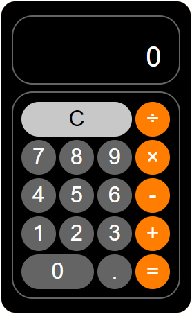

# CalculatorReactApp
Functional calculator built in React, styled using Sass.
## What I Learned:
- Using Sass variables, encapsulation, calculations and mixins
- Improved React syntax
- Mapping through JSON files
## GitHub Pages:
### Link:
https://jarodburchill.github.io/CalculatorReactApp
### Preview:

## Installation: 
```
git clone https://github.com/jarodburchill/CalculatorReactApp
cd CalculatorReactApp
npm install
npm start
```
